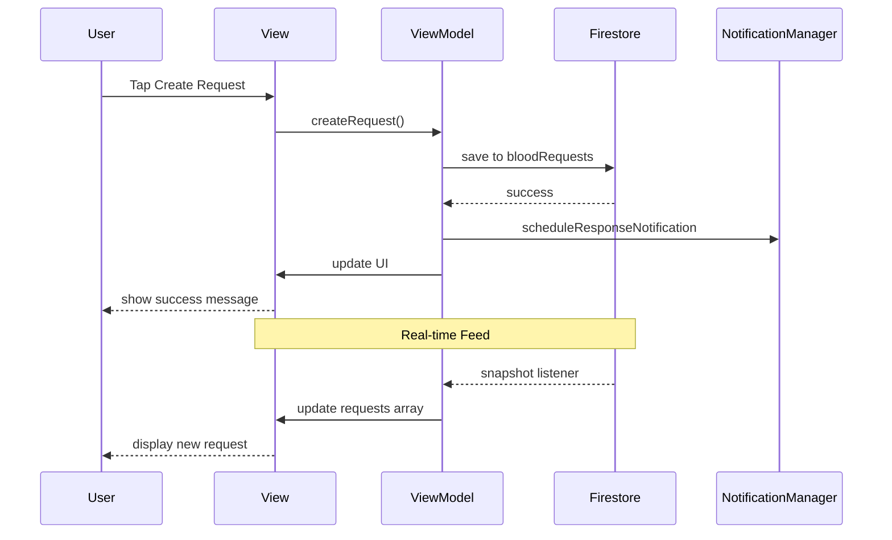
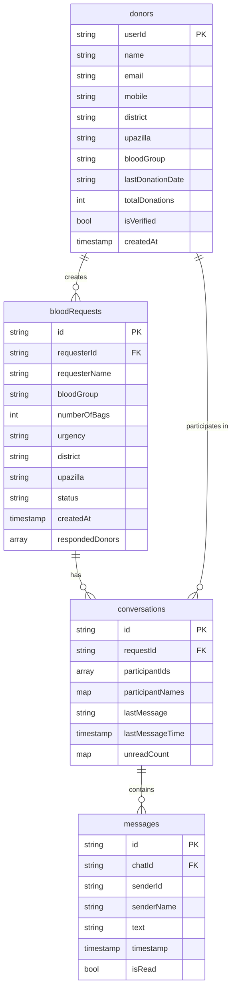

# BloodQ
A Swift App for making Blood Donation for accessible.
# BloodQ - Blood Donation Management System

## Overview

BloodQ is a comprehensive iOS application that connects blood donors with recipients in real-time. The app facilitates blood request creation, donor matching through feed browsing, in-app messaging, and donation tracking.

## Table of Contents

- [Features](#features)
- [Technology Stack](#technology-stack)
- [Requirements](#requirements)
- [Installation](#installation)
- [Firebase Configuration](#firebase-configuration)
- [Project Structure](#project-structure)
- [App Architecture](#app-architecture)
- [Database Schema](#database-schema)
- [User Flow Diagrams](#user-flow-diagrams)
- [Screenshots](#screenshots)
- [Key Features Explained](#key-features-explained)
- [API Integrations](#api-integrations)
- [Testing](#testing)
- [Troubleshooting](#troubleshooting)
- [Future Enhancements](#future-enhancements)
- [License](#license)

## Features

### Authentication
- Email and password sign up/sign in
- Password reset functionality
- Secure session management

### Donor Management
- Complete donor profile with NID verification
- Blood group selection (A+, A-, B+, B-, O+, O-, AB+, AB-)
- Location selection (District and Upazilla)
- Donation history tracking
- Last donation date tracking with 90-day eligibility period

### Blood Request System
- Create blood requests with urgency levels (Critical, Urgent, Normal)
- Specify number of bags needed (1-10)
- Real-time request feed
- Search and filter requests by blood group, location, or requester name
- Donors can browse and respond to any request

### Notification System
- Response notifications for requesters when a donor responds
- In-app toast notifications for new requests
- App badge count for unread messages
- Sound alerts

### Chat System
- Real-time messaging between donors and requesters
- Unread message count
- Conversation list with last message preview
- Message timestamps

### Leaderboard
- Rank donors by total donations
- Podium display for top 3 donors
- Complete leaderboard list with all donors

### User Dashboard
- Personal donation statistics
- Donation history view
- 90-day eligibility tracker with countdown
- Profile management

## Technology Stack

| Component | Technology |
|-----------|------------|
| Frontend | SwiftUI |
| Backend | Firebase Firestore |
| Authentication | Firebase Auth |
| Storage | Firebase Storage |
| Local Notifications | UserNotifications Framework |
| Location Services | CoreLocation, MapKit |
| Image Picker | PhotosUI |
| Network Requests | URLSession |
| Minimum iOS Version | 15.0 |

## Requirements

- Xcode 14.0 or later
- iOS 15.0 or later
- Swift 5.7 or later
- Firebase account
- Apple Developer account (for push notifications - optional)

## Installation

### Step 1: Clone the Repository

```bash
git clone https://github.com/yourusername/BloodQ.git
cd BloodQ
```

### Step 2: Install Dependencies

The project uses Swift Package Manager. Open the project in Xcode and SPM will automatically resolve dependencies.

Required packages:
- Firebase iOS SDK
- FirebaseFirestore
- FirebaseAuth
- FirebaseStorage

### Step 3: Firebase Setup

1. Create a new project in [Firebase Console](https://console.firebase.google.com)
2. Register your iOS app with bundle ID: `the.bloodQ.app.BloodQ`
3. Download `GoogleService-Info.plist`
4. Add the file to your Xcode project

### Step 4: Build and Run

1. Open `BloodQ.xcodeproj` in Xcode
2. Select your target device or simulator
3. Press `Cmd + R` to build and run

## Firebase Configuration

### Firestore Collections Structure

#### donors Collection

```swift
{
  "userId": String,
  "name": String,
  "email": String,
  "mobile": String,
  "district": String,
  "upazilla": String,
  "bloodGroup": String,
  "lastDonationDate": String,
  "donationHistory": Array,
  "totalDonations": Int,
  "isVerified": Bool,
  "nidNumber": String,
  "profileImageURL": String,
  "createdAt": Timestamp,
  "updatedAt": Timestamp
}
```

#### bloodRequests Collection

```swift
{
  "requesterId": String,
  "requesterName": String,
  "requesterPhone": String,
  "bloodGroup": String,
  "numberOfBags": Int,
  "urgency": String,
  "location": GeoPoint,
  "locationName": String,
  "district": String,
  "upazilla": String,
  "hospitalName": String,
  "description": String,
  "status": String,
  "createdAt": Timestamp,
  "expiresAt": Timestamp,
  "respondedDonors": Array
}
```

#### conversations Collection

```swift
{
  "requestId": String,
  "participantIds": Array,
  "participantNames": Map,
  "lastMessage": String,
  "lastMessageTime": Timestamp,
  "unreadCount": Map
}
```

#### messages Subcollection

```swift
{
  "chatId": String,
  "senderId": String,
  "senderName": String,
  "text": String,
  "timestamp": Timestamp,
  "isRead": Bool
}
```

## Project Structure

```
BloodQ/
├── BloodQ/
│   ├── Models/
│   │   └── Donor.swift
│   ├── Views/
│   │   ├── Auth/
│   │   │   └── ModernAuthView.swift
│   │   ├── BloodRequest/
│   │   │   ├── CreateRequestView.swift
│   │   │   └── RequestDetailView.swift
│   │   ├── Chat/
│   │   │   ├── ChatView.swift
│   │   │   └── ChatsListView.swift
│   │   ├── Main/
│   │   │   ├── DashboardView.swift
│   │   │   ├── FeedView.swift
│   │   │   ├── LeaderboardView.swift
│   │   │   ├── MainTabView.swift
│   │   │   ├── ProfileView.swift
│   │   │   └── SearchView.swift
│   │   ├── Profile/
│   │   │   └── CompleteProfileView.swift
│   │   └── WelcomeView.swift
│   ├── ViewModels/
│   │   ├── AuthViewModel.swift
│   │   ├── BloodRequestViewModel.swift
│   │   ├── ChatViewModel.swift
│   │   └── DonorViewModel.swift
│   ├── Services/
│   │   ├── LocationManager.swift
│   │   ├── NIDVerificationService.swift
│   │   └── NotificationManager.swift
│   ├── Resources/
│   │   └── areas.json
│   ├── Assets.xcassets/
│   ├── GoogleService-Info.plist
│   └── BloodQApp.swift
└── BloodQ.xcodeproj/
```


### Data Flow

<div align="center" style="width: 100%; max-width: 600px; margin: 0 auto;">



</div>

## Database Schema Diagram

<div align="center" style="width: 100%; max-width: 700px; height: 500px; margin: 0 auto; border: 1px solid #ddd; border-radius: 8px; padding: 10px; overflow-y: auto; background: #fafafa;">


</div>

## Screenshots

### Authentication Flow

| Welcome Screen | Sign In | Sign Up | Forgot Password |
|----------------|---------|---------|-----------------|
| [Screenshot]    | [Screenshot] | [Screenshot] | [Screenshot] |

### Main App Screens

| Feed | Search | Dashboard |
|------|--------|-----------|
| [Screenshot] | [Screenshot] | [Screenshot] |

| Leaderboard | Chat List | Chat Detail |
|-------------|-----------|--------------|
| [Screenshot] | [Screenshot] | [Screenshot] |

### Profile Management

| Profile | Edit Profile | Complete Profile |
|---------|--------------|------------------|
| [Screenshot] | [Screenshot] | [Screenshot] |

### Request Flow

| Create Request | Request Detail | Response Confirmation |
|----------------|----------------|----------------------|
| [Screenshot]    | [Screenshot]    | [Screenshot] |

### Donation Management

| Dashboard Stats | Add Donation | Donation History |
|-----------------|--------------|------------------|
| [Screenshot]     | [Screenshot]  | [Screenshot] |

## Key Features Explained

### Donor Eligibility System

Donors are eligible to donate if:
- No previous donation recorded, OR
- Last donation was 90+ days ago

```swift
var canDonate: Bool {
    guard !lastDonationDate.isEmpty else { return true }
    let daysSinceLastDonation = // calculate days
    return daysSinceLastDonation >= 90
}
```

The dashboard shows a circular progress indicator showing days remaining until next eligible donation.

### Real-time Feed

The feed uses Firestore listeners to update automatically when new requests are created:

```swift
listener = db.collection("bloodRequests")
    .whereField("status", isEqualTo: "Active")
    .addSnapshotListener { snapshot, error in
        // Update UI automatically
    }
```

Features:
- Search by blood group, location, or requester name
- Pull to refresh
- Toast notification for new requests
- Urgency indicators (Red for Critical, Orange for Urgent, Blue for Normal)

### Chat System

When a donor responds to a request:
1. A conversation document is created
2. Both users can access the chat
3. Real-time message delivery
4. Unread message badges
5. Message timestamps

### Leaderboard System

The leaderboard ranks donors based on total donations:
- Top 3 donors shown on podium with special styling
- Crown icon for 1st place
- Complete list of all donors with ranks
- Shows blood group and donation count

## API Integrations

### NID Verification Service

The app uses OpenRouter API with NVIDIA Nemotron model for NID verification:

- Endpoint: `https://openrouter.ai/api/v1/chat/completions`
- Model: `nvidia/nemotron-nano-12b-v2-vl:free`
- Verifies front and back images of Bangladesh NID cards
- Extracts NID number, name, and date of birth

**Note:** Replace the API key in `NIDVerificationService.swift` with your own key before production.

### Location Services

Uses Apple's CoreLocation and MapKit frameworks:
- Reverse geocoding for address lookup
- MKLocalSearch for location search
- District and Upazilla selection from local JSON file

## Testing

### Simulator Testing

**Notifications:**
- Response notifications work fully on simulator
- Test with multiple simulator instances for donor/requester flow

**Location:**
- Use Simulator > Features > Location to set custom locations
- Test with different districts and upazillas

### Test Accounts

Create test donors with different:
- Blood groups
- Districts and upazillas
- Donation histories
- Eligibility status

### Testing Flow

1. **Create two test users:**
   - Donor: Complete profile with A+ blood, Dhaka, Dhanmondi
   - Requester: Create blood request with matching criteria

2. **Donor browses feed and finds the request**

3. **Donor responds to request**

4. **Verify notification appears on requester's device**

5. **Chat between both users**

6. **Verify donation history updates on dashboard**

## Troubleshooting

### Common Issues and Solutions

| Issue | Solution |
|-------|----------|
| Notifications not showing | Check notification permissions in Settings |
| Firestore not connecting | Verify GoogleService-Info.plist is in project |
| Location not working | Enable Location Services in Simulator/Device |
| NID verification fails | Ensure clear, well-lit images of both card sides |
| Chat not loading | Check Firestore security rules |
| Badge count not updating | Restart app to reset badge |
| Donor eligibility not updating | Verify lastDonationDate format is "yyyy-MM-dd" |

### Debug Commands

Check Firestore connection:
```swift
Firestore.firestore().collection("test").getDocuments { snapshot, error in
    print(error?.localizedDescription ?? "Connected")
}
```

Print current user ID:
```swift
print("Current user: \(Auth.auth().currentUser?.uid ?? "nil")")
```

### Simulator Tips

1. **Reset Simulator:** Device > Erase All Content and Settings
2. **Test Multiple Users:** Run multiple simulator instances with different accounts
3. **Location Simulation:** Features > Location > Custom Location
4. **Test Notifications:** Response notifications work immediately

## Future Enhancements

- [ ] Push notifications for production
- [ ] Blood bank integration
- [ ] Emergency contact system
- [ ] Donor rating system
- [ ] Blood inventory tracking
- [ ] Appointment scheduling
- [ ] Multi-language support
- [ ] Dark mode optimization
- [ ] Widget for nearby requests
- [ ] Apple Watch companion app
- [ ] Blood donation camp locator
- [ ] QR code for donor verification
- [ ] Donation certificates
- [ ] Social media sharing
- [ ] Blood type compatibility checker
- [ ] Export donation history as PDF

## License

Copyright © 2026 BloodQ. All rights reserved.

## Support

For issues or questions:
- GitHub Issues: [commoner02/BloodQ]

## Contributors

- Project maintained by BloodQ Team
- 2107103: Saleheen Uddin Sakin
- 2107105: Abdullah Al Noman
- 2107116: Sree Shuvo Kumar Joy

---

**BloodQ - Connecting Lives, Saving Communities**
