# BloodQ

**Connecting Lives, Saving Communities**

BloodQ is a comprehensive iOS application built with SwiftUI that connects blood donors with recipients in real-time. The app facilitates blood request creation, donor matching through a live feed, in-app messaging, and donation tracking.

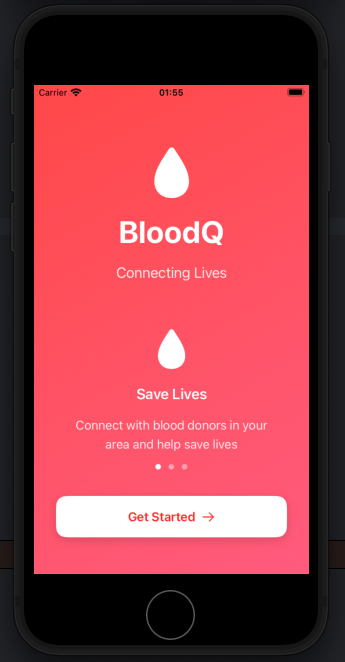

## Table of Contents

- [Features](#features)
- [Screenshots](#screenshots)
- [Technology Stack](#technology-stack)
- [Requirements](#requirements)
- [Installation](#installation)
- [Firebase Configuration](#firebase-configuration)
- [Project Structure](#project-structure)
- [App Architecture](#app-architecture)
- [Database Schema](#database-schema)
- [Key Features Explained](#key-features-explained)
- [Testing](#testing)
- [Future Enhancements](#future-enhancements)
- [License](#license)
- [Contributors](#contributors)

## Features

### Authentication
- Email and password sign up/sign in
- Password reset functionality
- Secure session management
- NID verification for donor authenticity

| Sign Up | Login | Reset Password |
|---------|-------|----------------|
| 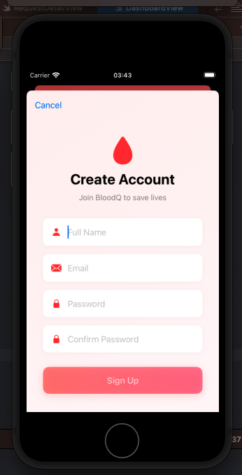 | 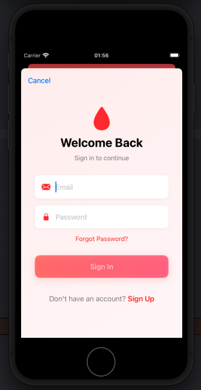 | 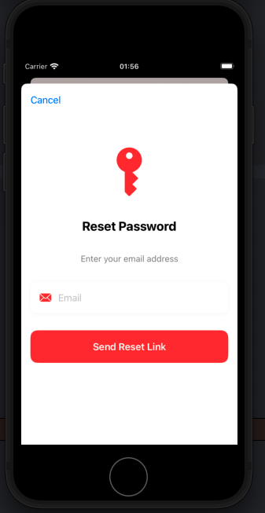 |

### Donor Management
- Complete donor profile with NID verification
- Blood group selection (A+, A-, B+, B-, O+, O-, AB+, AB-)
- Location selection (District and Upazilla)
- Donation history tracking
- Last donation date tracking with 90-day eligibility period

| NID Verification - Start | NID Verification - End |
|--------------------------|-------------------------|
| 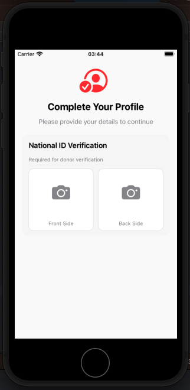 | 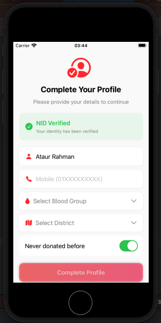 |

### Blood Request System
- Create blood requests with urgency levels (Normal, Urgent, Critical)
- Specify number of bags needed (1-10)
- Real-time request feed
- Search and filter requests

| Create Request | Request Feed |
|----------------|----------------|
| 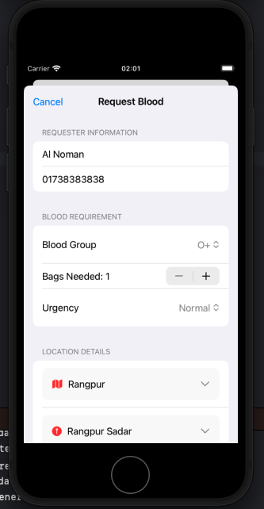 | 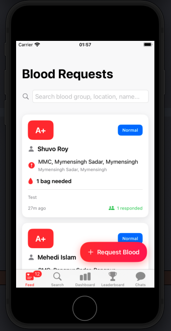 |

### Donor Search & Leaderboard
- Find donors by blood group and location
- Leaderboard ranking donors by total donations

| Search Donors | Leaderboard |
|---------------|-------------|
| 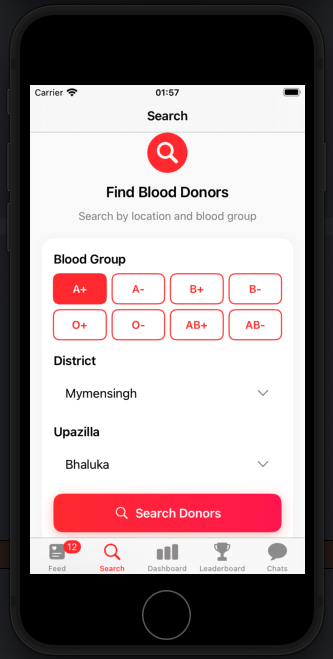 | 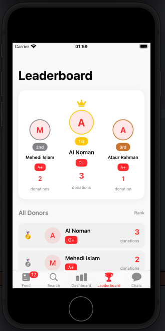 |

### Dashboard & Chat
- Personal donation statistics and eligibility tracker
- Real-time messaging between donors and requesters
- Unread message count and conversation list

| Dashboard | Chat Interface |
|-----------|----------------|
| 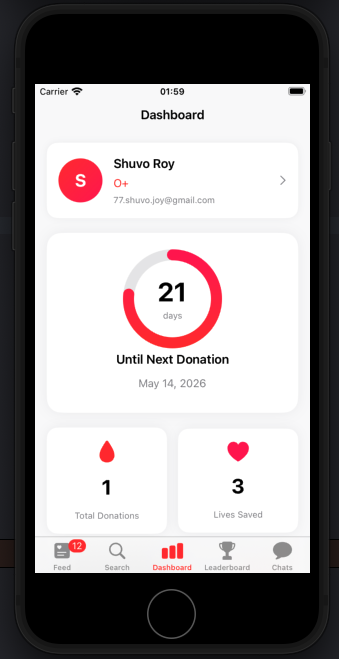 | 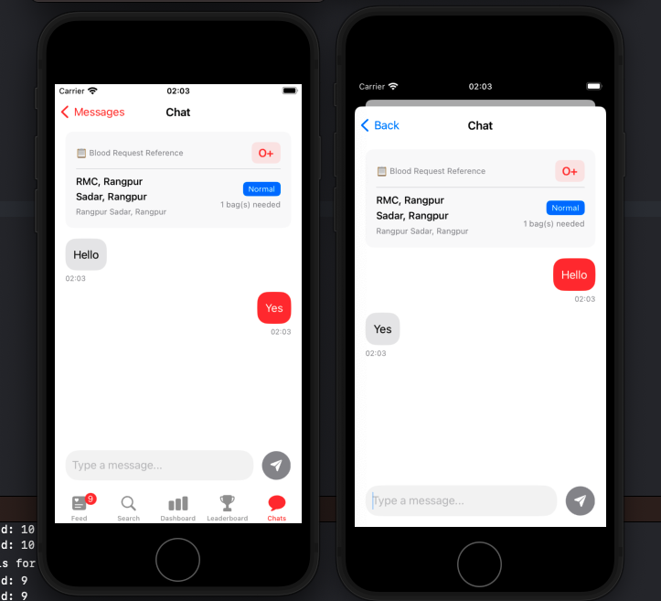 |

## Technology Stack

| Component | Technology |
|-----------|------------|
| Frontend | SwiftUI |
| Backend | Firebase Firestore |
| Authentication | Firebase Auth |
| Storage | Firebase Storage |
| Local Notifications | UserNotifications Framework |
| Location Services | CoreLocation, MapKit |
| NID Verification | OpenRouter API (NVIDIA Nemotron) |
| Minimum iOS Version | 15.0 |

## Requirements

- Xcode 14.0 or later
- iOS 15.0 or later
- Swift 5.7 or later
- Firebase account
- OpenRouter API key (for NID verification)

## Installation

### Step 1: Clone the Repository

```bash
git clone https://github.com/yourusername/BloodQ.git
cd BloodQ
```

### Step 2: Install Dependencies

The project uses Swift Package Manager. Open the project in Xcode and SPM will automatically resolve dependencies.

Required packages:
- Firebase iOS SDK
- FirebaseFirestore
- FirebaseAuth
- FirebaseStorage

### Step 3: Firebase Setup

1. Create a new project in [Firebase Console](https://console.firebase.google.com)
2. Register your iOS app with bundle ID: `the.bloodQ.app.BloodQ`
3. Download `GoogleService-Info.plist`
4. Add the file to your Xcode project

### Step 4: NID Verification API Setup

1. Sign up at [OpenRouter](https://openrouter.ai/)
2. Get your API key
3. Add the API key to `NIDVerificationService.swift`:

```swift
private let apiKey = "YOUR_OPENROUTER_API_KEY"
```

### Step 5: Build and Run

1. Open `BloodQ.xcodeproj` in Xcode
2. Select your target device or simulator
3. Press `Cmd + R` to build and run

## Firebase Configuration

### Firestore Collections Structure

#### donors Collection

```swift
{
  "userId": String,
  "name": String,
  "email": String,
  "mobile": String,
  "district": String,
  "upazilla": String,
  "bloodGroup": String,
  "lastDonationDate": String,
  "totalDonations": Int,
  "isVerified": Bool,
  "nidNumber": String,
  "nidVerified": Bool,
  "createdAt": Timestamp
}
```

#### bloodRequests Collection

```swift
{
  "requesterId": String,
  "requesterName": String,
  "requesterPhone": String,
  "bloodGroup": String,
  "numberOfBags": Int,
  "urgency": String, // "Normal", "Urgent", "Critical"
  "district": String,
  "upazilla": String,
  "status": String, // "Active", "Fulfilled", "Expired"
  "createdAt": Timestamp
}
```

#### conversations & messages

```swift
// conversations collection
{
  "requestId": String,
  "participantsIds": [String],
  "lastMessage": String,
  "unreadCount": [String: Int]
}

// messages subcollection
{
  "senderId": String,
  "text": String,
  "timestamp": Timestamp,
  "isRead": Bool
}
```

## Project Structure

```
BloodQ/
├── BloodQ/
│   ├── Models/
│   │   ├── Donor.swift
│   │   └── BloodRequest.swift
│   ├── Views/
│   │   ├── Auth/
│   │   │   ├── LoginView.swift
│   │   │   ├── SignUpView.swift
│   │   │   └── NIDVerificationView.swift
│   │   ├── BloodRequest/
│   │   │   ├── CreateRequestView.swift
│   │   │   └── RequestDetailView.swift
│   │   ├── Chat/
│   │   │   ├── ChatView.swift
│   │   │   └── ChatsListView.swift
│   │   ├── Main/
│   │   │   ├── DashboardView.swift
│   │   │   ├── FeedView.swift
│   │   │   ├── LeaderboardView.swift
│   │   │   ├── MainTabView.swift
│   │   │   └── SearchView.swift
│   │   └── WelcomeView.swift
│   ├── ViewModels/
│   │   ├── AuthViewModel.swift
│   │   ├── BloodRequestViewModel.swift
│   │   ├── ChatViewModel.swift
│   │   └── DonorViewModel.swift
│   ├── Services/
│   │   ├── LocationManager.swift
│   │   ├── NotificationManager.swift
│   │   └── NIDVerificationService.swift
│   └── BloodQApp.swift
└── BloodQ.xcodeproj/
```

## App Architecture

### Class Diagram

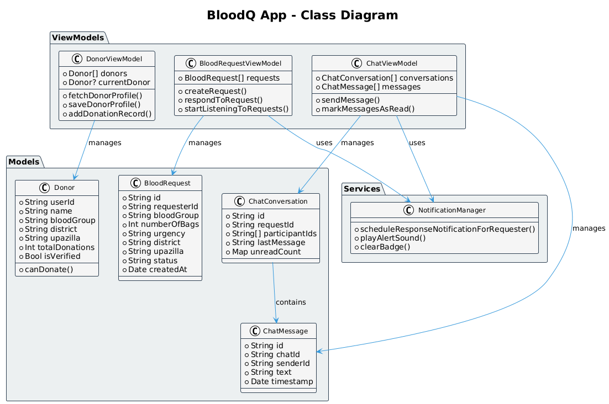

The app follows the MVVM (Model-View-ViewModel) architecture:

- **Models**: Data structures (Donor, BloodRequest, ChatConversation)
- **Views**: SwiftUI screens (Dashboard, Feed, Chat, etc.)
- **ViewModels**: Business logic and state management
- **Services**: Firebase operations, notifications, location, NID verification

### Data Flow

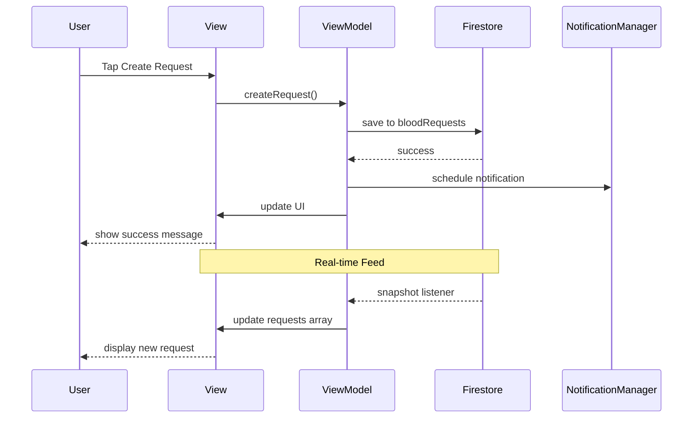

### NID Verification Flow

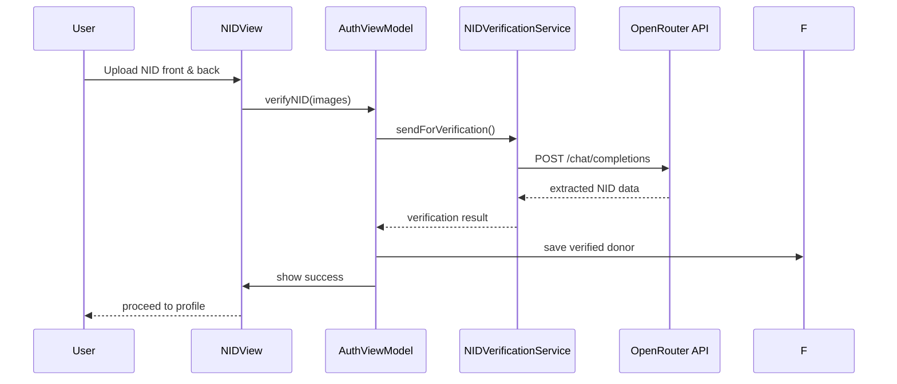

## Key Features Explained

### NID Verification System

The app uses OpenRouter API with NVIDIA Nemotron model for NID verification:

- Verifies front and back images of Bangladesh NID cards
- Extracts NID number, name, and date of birth
- Ensures donor authenticity before allowing blood requests

```swift
func verifyNID(frontImage: UIImage, backImage: UIImage) async throws -> NIDResult {
    // Convert images to base64
    // Send to OpenRouter API
    // Parse and return extracted information
}
```

### Donor Eligibility System

Donors are eligible to donate if:
- No previous donation recorded, OR
- Last donation was 90+ days ago

```swift
var canDonate: Bool {
    guard !lastDonationDate.isEmpty else { return true }
    let daysSinceLastDonation = calculateDaysSince(lastDonationDate)
    return daysSinceLastDonation >= 90
}
```

### Real-time Feed

The feed uses Firestore listeners to update automatically when new requests are created:

- Search by blood group, location, or requester name
- Pull to refresh
- Urgency indicators (Red for Critical, Orange for Urgent, Blue for Normal)

### Chat System

When a donor responds to a request:
1. A conversation document is created
2. Both users can access the chat
3. Real-time message delivery
4. Unread message badges

### Leaderboard System

The leaderboard ranks donors based on total donations:
- Top 3 donors shown on podium with special styling
- Crown icon for 1st place
- Complete list of all donors with ranks

## Testing

### Simulator Testing

**Notifications:**
- Response notifications work fully on simulator
- Test with multiple simulator instances for donor/requester flow

**Location:**
- Use Simulator > Features > Location to set custom locations

**NID Verification:**
- Test with clear, well-lit images of both card sides
- Simulator can use photo library with sample NID images

### Test Accounts

Create test donors with different:
- Blood groups
- Districts and upazillas
- Donation histories
- NID verification status

### Testing Flow

1. **Create two test users:**
   - Donor: Complete profile with NID verification, A+ blood, Dhaka
   - Requester: Create blood request

2. **Donor browses feed and finds the request**

3. **Donor responds to request**

4. **Verify notification appears on requester's device**

5. **Chat between both users**

## Troubleshooting

| Issue | Solution |
|-------|----------|
| Notifications not showing | Check notification permissions in Settings |
| Firestore not connecting | Verify GoogleService-Info.plist is in project |
| Location not working | Enable Location Services in Simulator/Device |
| Chat not loading | Check Firestore security rules |
| Badge count not updating | Restart app to reset badge |
| NID verification fails | Ensure clear, well-lit images of both card sides |
| NID API error | Verify OpenRouter API key and internet connection |

## Future Enhancements

- [ ] Push notifications for production
- [ ] Blood bank integration
- [ ] Emergency contact system
- [ ] Donor rating system
- [ ] Multi-language support
- [ ] Dark mode optimization
- [ ] Widget for nearby requests
- [ ] Apple Watch companion app
- [ ] Donation certificates
- [ ] Blood type compatibility checker
- [ ] Automated NID text extraction
- [ ] Face verification for added security

## License

Copyright © 2026 BloodQ. All rights reserved.

## Contributors

- **2107103**: Saleheen Uddin Sakin
- **2107105**: Abdullah Al Noman
- **2107116**: Sree Shuvo Kumar Joy

---

**BloodQ - Connecting Lives, Saving Communities**
